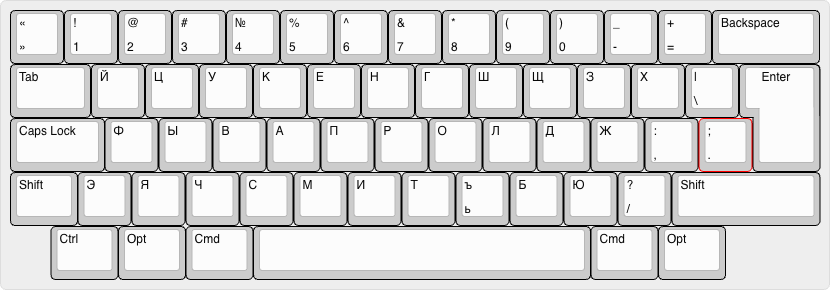

This is my personal keyboard layouts.

https://keyboard-layout-editor.com/#/

[EN](./keyboard-layout-en.kle)

English layout is based on regular QWERTY layout, but with small tweaks for comma, period and question mark.
Letters E and J are swapped, so that E is on the home row and J is on the second row.

[RU](./keyboard-layout-ru.kle)

Base Russian keyboard layout, but with small tweaks for comma, period and question mark.

[HE](./keyboard-layout-he.kle)

Similar to the Russian layout, just small tweaks for Hebrew language. 

