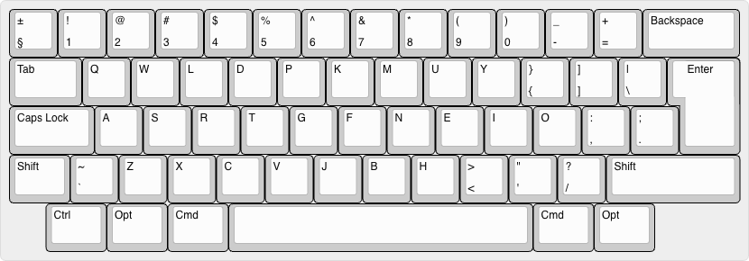

## This is my personal keyboard layouts.

https://keyboard-layout-editor.com/#/

[EN](./keyboard-layout-en.kle)

English layout is based on regular QWERTY layout, but with small tweaks.
Letters E and J are swapped, so that E is on the home row and J is on the second row.
Comma, period and question marks have been moved to different places.

[RU](./keyboard-layout-ru.kle)

Base Russian keyboard layout, but with small tweaks for comma, period and question mark.

[HE](./keyboard-layout-he.kle)

Similar to the Russian layout, just small tweaks for Hebrew language. 

## Installation of the keyboard layout bundle file

Copy MMKL.bundle file to either:

- /Library/Keyboard Layouts/ (all users)
- ~/Library/Keyboard Layouts/ (current user only)

Log out and log back in, or restart Mac

Enable layouts:

Open System Settings > Keyboard > Input Sources
Click the + button
Find layouts under "Custom" section
Select and add each layout

### Troubleshooting

If layouts don't appear, check permissions: chmod -R 644 ~/Library/Keyboard\ Layouts/MMKL.bundle
Clear keyboard cache: sudo touch /System/Library/Extensions
Restart may be required
